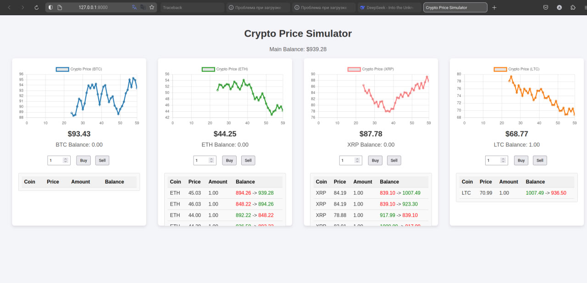

# Stock Exchange Simulation



Этот проект представляет собой симулятор биржи криптовалют с графиками в реальном времени, балансом и возможностью покупки/продажи монет. Проект написан на Python с использованием **FastAPI** для бэкенда и **Chart.js** для отображения графиков на фронтенде.

## Запуск проекта

---

1. **Клонируйте репозиторий**:
    ```bash
    git clone https://github.com/morington/StockExchangeSimulation.git
    ```
    ```bash
    cd StockExchangeSimulation
    ```

2. **Установите зависимости**:
   ```bash
   pip install -r requirements.txt
   ```

3. **Запустите сервер**:
   ```bash
   uvicorn main:app --reload
   ```

4. **Откройте в браузере**:
   - Перейдите по адресу http://localhost:8000.


## Как пользоваться

---

1. **Графики**: На странице отображаются 4 графика для криптовалют (BTC, ETH, XRP, LTC). Каждый график обновляется в реальном времени.
2. **Баланс**: В верхней части страницы отображается основной баланс. Под каждым графиком показан баланс соответствующей монеты.
3. **Покупка/продажа**:
   - Введите количество монет в поле ввода.
   - Нажмите Buy, чтобы купить, или Sell, чтобы продать.
   - Если на балансе недостаточно средств или монет, появится сообщение об ошибке.
4. **История операций**: Под каждым графиком отображается история покупок/продаж с указанием цены, количества и изменений баланса.

## Особенности

---

1. Реальное время: Графики обновляются каждую секунду.
2. Интерактивность: Возможность покупать и продавать монеты по текущему курсу.
3. История операций: Все операции сохраняются и отображаются в таблице под графиками.
4. Цветовая индикация:
   - При покупке: старый баланс отображается красным, новый — зелёным.
   - При продаже: старый баланс отображается зелёным, новый — красным.

## Лицензия

---

Этот проект распространяется под лицензией MIT. Подробности см. в файле LICENSE.